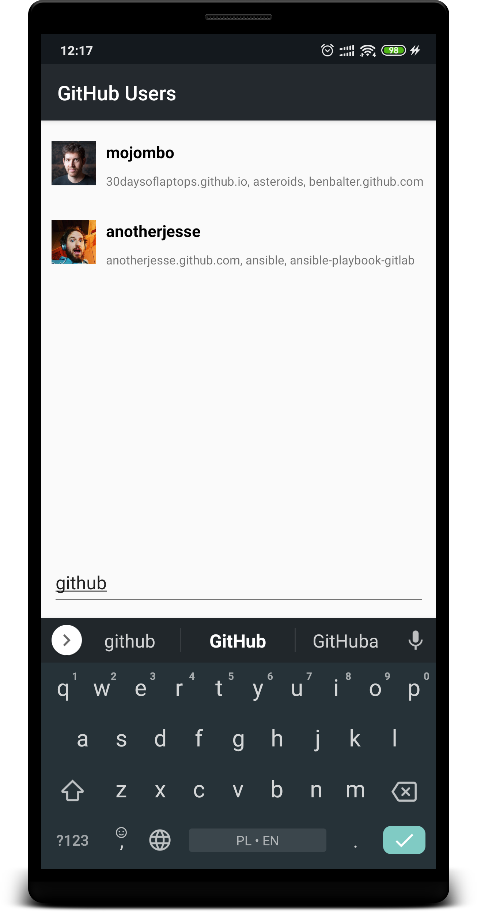

# GitHub Users

## Project overview
Example Android application. Application code developed by [@piotrsulej](https://github.com/piotrsulej), automated interface tests developed by [@BartoszDybczak](https://github.com/BartoszDybczak).

## Example screenshots

## Features
* Application will display list of the first 30 GitHub users and 3 of their repositories
* Application will download users list only once and save it to database for future usage
* You can filter the list by typing part of user's login
* You can filter the list by typing part of user's repository name

## Project structure
* **users** - contains all the code related to users list feature.
* **users-mock** - contains automated user interface tests of users list and dependency configuration for users lists with model layer depending on static mock data from JSON assets instead of network call. This allows to test users-feature interface in isolation from the application. With this approach features can be reused by different applications and they don't need to be tested multiple times.  
* **app** - dependency configuration of application.
* **app-res** - directory used by both *app* and *users-mock* to store shared resources (icon, theme).

## Overview of dependencies
### Dependency injection
* https://github.com/google/dagger
### Asynchronicity
* https://github.com/ReactiveX/RxJava
### Images loading
* https://github.com/bumptech/glide
### Network operations
* https://github.com/square/retrofit
### Database
* https://developer.android.com/jetpack/androidx/releases/room
### Testing
* https://github.com/junit-team/junit4
* https://github.com/nhaarman/mockito-kotlin
* https://github.com/joel-costigliola/assertj-core
* https://developer.android.com/training/testing/espresso
### JSON (de)serialization
* https://github.com/google/gson
### User Interface
* https://developer.android.com/jetpack/androidx/releases/appcompat
* https://developer.android.com/jetpack/androidx/releases/constraintlayout
* https://github.com/sockeqwe/AdapterDelegates

## Build and test

Here you can find list of useful commands to build and test the application:
* `./gradlew build` - assemble all modules and run unit tests for them.
* `./gradlew connectedAndroidTest` - run Android tests on mock data.
* `./gradlew installDebug` - install all of the applications listed below.
* `./gradlew app:installDebug` - install application.
* `./gradlew users-mock:installDebug` - install application with mock version of users feature - for testing purpose.
